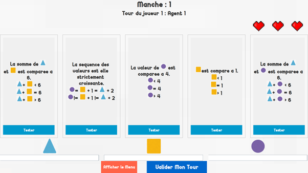

# AP4B-Turing_Machine
<<<<<<< HEAD

=======
>>>>>>> d2dec4f3690c017c65af8630d9098f7ba2b7145c
# Machine de Turing - Version Numérique

Bienvenue dans **Machine de Turing**, une version numérique et virtuelle du célèbre jeu de société. Ce projet est développé en Java 17 avec JavaFX 17 pour l'interface graphique. Toutes les librairies nécessaires sont incluses dans le projet, vous permettant de démarrer rapidement sans configuration supplémentaire.

## 📋 Fonctionnalités

- Interface utilisateur intuitive.
- Recréation fidèle des mécanismes du jeu de société.
- Mode solo et multijoueur.
- Historique des parties et scores enregistrés.
- Animations interactives pour une expérience immersive.

---

<<<<<<< HEAD
=======
## Aperçu de l'interface

Voici un aperçu de l'interface utilisateur de l'application :



---

>>>>>>> d2dec4f3690c017c65af8630d9098f7ba2b7145c
## 🛠️ Configuration requise

- **Java** : JDK 17.
- **Système d'exploitation** : Windows, macOS, ou Linux.

*Toutes les dépendances nécessaires sont incluses dans le projet et n'exigent pas de téléchargement ou de configuration supplémentaire.*

---

## 🚀 Installation et Exécution

1. Clonez ou téléchargez ce dépôt :
   ```bash
   git clone https://github.com/TalhaK28/AP4B-Turing_Machine.git
   cd AP4B-Turing_Machine
